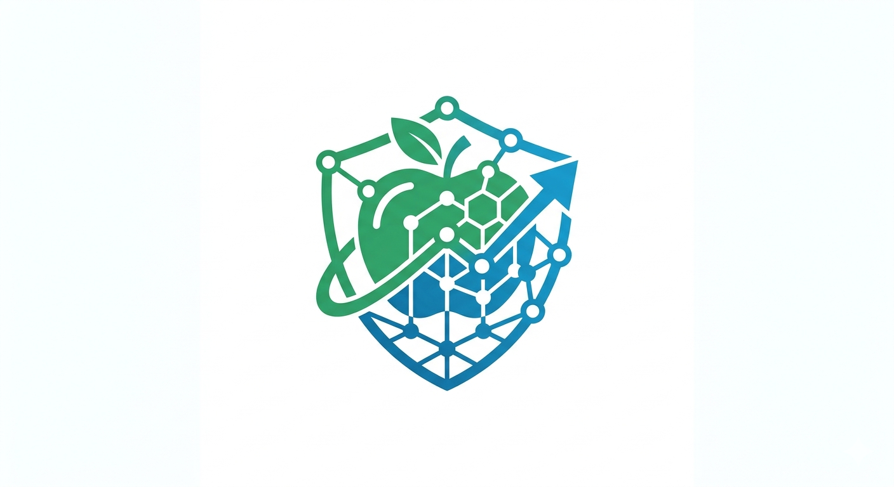
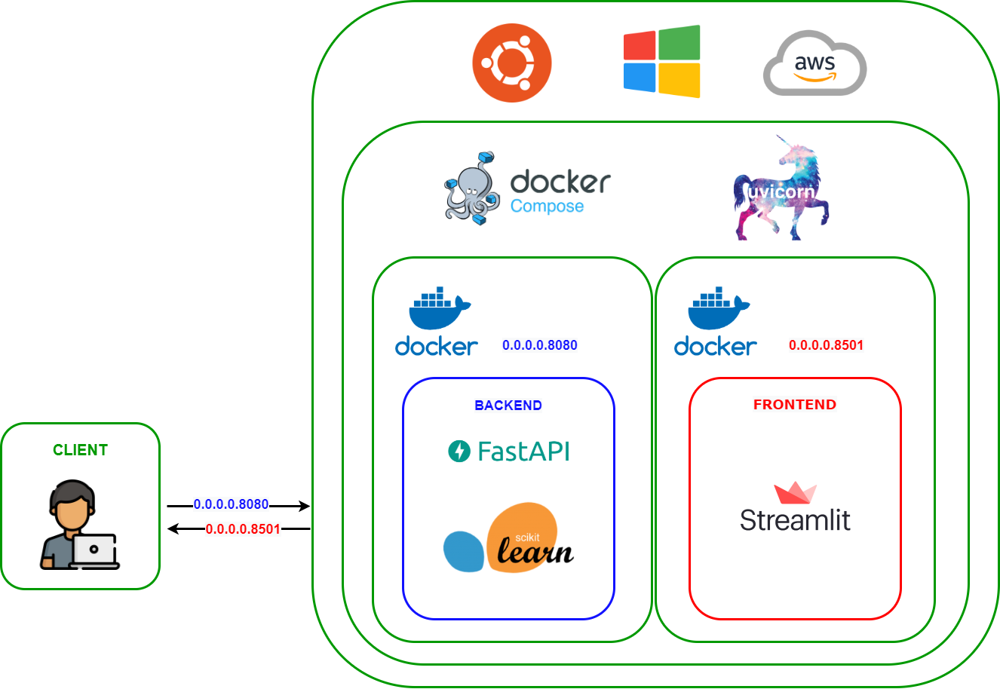

<div align="center">

[](https://github.com/zakaria-narjis/Diet-Recommendation-System/actions/workflows/ci.yml) [](https://zenodo.org/doi/10.5281/zenodo.12507163) [](https://github.com/astral-sh/ruff)

</div>

<h1 align="center">Diet Recommendation System</h1>
<div align="center">
  
  <h4>A content-based diet recommendation web app built with Scikit-Learn, FastAPI, and Streamlit.</h4>
</div>

---

## Table of Contents

- [Overview](#overview)
- [Architecture](#architecture)
- [How It Works](#how-it-works)
- [Tech Stack](#tech-stack)
- [Setup](#setup)
- [API Reference](#api-reference)
- [Dataset](#dataset)
- [Citation](#citation)

---

## Star History

<a href="https://www.star-history.com/?repos=zakaria-narjis%2FDiet-Recommendation-System&type=date&legend=top-left">
 <picture>
   <source media="(prefers-color-scheme: dark)" srcset="https://api.star-history.com/image?repos=zakaria-narjis/Diet-Recommendation-System&type=date&theme=dark&legend=top-left" />
   <source media="(prefers-color-scheme: light)" srcset="https://api.star-history.com/image?repos=zakaria-narjis/Diet-Recommendation-System&type=date&legend=top-left" />
   
 </picture>
</a>

---

## Overview

A full-stack diet recommendation system that generates personalized meal plans based on user health data (age, weight, height, activity level) or custom nutritional targets. The recommendation engine uses a content-based approach with cosine similarity over nutritional vectors to find the closest matching recipes from a dataset of 500,000+ Food.com recipes.

**Key features:**
- Automatic meal plan generation from personal health metrics (BMI, BMR, TDEE)
- Custom food search by nutritional values and ingredients
- Configurable weight loss plans (maintain, mild, moderate, extreme)
- Interactive nutritional breakdown charts

---

## Architecture

<div align="center"></div>

---

## How It Works

### Recommendation Engine

Recipes are embedded as 9-dimensional nutritional vectors (Calories, Fat, Saturated Fat, Cholesterol, Sodium, Carbohydrates, Fiber, Sugar, Protein). A `NearestNeighbors` model with cosine similarity finds the closest recipes to a given target vector.

### Automatic Meal Plan (`/generate-meal-plan/`)

1. **BMI** — weight(kg) / height(m)²
2. **BMR** — Mifflin-St Jeor equation
3. **TDEE** — BMR × activity multiplier
4. **Target calories** — TDEE × weight-loss factor
5. Calories are distributed across meals (35/40/25% for 3 meals, etc.)
6. Per-meal nutrition vectors are sampled from physiologically appropriate ranges and passed to the nearest-neighbor model

### Ingredient Filtering

At startup, each recipe's ingredient list is pre-parsed into a `frozenset` of lowercase strings. Filtering then uses set-based substring matching — no regex scanning on every request.

### Content-Based Approach

| Advantage | Note |
|-----------|------|
| No cold-start problem | Works without any user history |
| Transparent recommendations | Results are directly tied to nutritional targets |
| No inter-user data needed | Fully self-contained per request |

---

## Tech Stack

| Component | Technology |
|-----------|-----------|
| Backend API | FastAPI 0.115, Python 3.12 |
| ML / Recommendation | scikit-learn 1.4 (NearestNeighbors, cosine) |
| Data processing | pandas 2.2, numpy 1.26 |
| Frontend | Streamlit 1.35 |
| Charts | streamlit-echarts 0.4 |
| Containerization | Docker, Docker Compose |


---

## Setup

### Prerequisites

- [Docker](https://docs.docker.com/get-docker/) and Docker Compose

### Run with Docker Compose

**Option A — Use pre-built images** (fastest, no build step):

```bash
git clone https://github.com/zakaria-narjis/Diet-Recommendation-System
cd Diet-Recommendation-System
docker compose pull
docker compose up -d
```

**Option B — Build from source**:

```bash
git clone https://github.com/zakaria-narjis/Diet-Recommendation-System
cd Diet-Recommendation-System
docker compose up --build -d
```

Open **http://localhost:8501** in your browser.

> The frontend waits for the backend health check to pass before starting. The backend loads the ~95MB dataset at startup, so the first boot takes ~30–60 seconds.

### Hosted Version

https://diet-recommendation-system.streamlit.app/

---

## API Reference

Interactive docs are available at **http://localhost:8080/docs** when the backend is running.

### `POST /generate-meal-plan/`

Generates a full daily meal plan from personal health data.

**Request body:**
```json
{
  "age": 28,
  "height": 175,
  "weight": 70,
  "gender": "Male",
  "activity": "Moderate exercise (3-5 days/wk)",
  "number_of_meals": 3,
  "weight_loss": "Maintain weight"
}
```

**Response:** BMI, BMR, daily calorie targets, and recommended recipes per meal.

### `POST /predict/`

Finds recipes matching a custom 9-value nutrition vector with optional ingredient filtering.

**Request body:**
```json
{
  "nutrition_input": [500, 20, 3, 50, 800, 60, 8, 5, 30],
  "ingredients": ["chicken", "garlic"],
  "params": {"n_neighbors": 5, "return_distance": false}
}
```

---

## Dataset

Food.com recipes dataset — 500,000+ recipes from [Kaggle](https://www.kaggle.com/datasets/irkaal/foodcom-recipes-and-reviews?select=recipes.csv).

---

## Citation

```bibtex
@software{narjis_2024_12507829,
  author       = {Narjis, Zakaria},
  title        = {Diet recommendation system},
  month        = jun,
  year         = 2024,
  publisher    = {Zenodo},
  version      = {v1.0.1},
  doi          = {10.5281/zenodo.12507829},
  url          = {https://doi.org/10.5281/zenodo.12507829}
}
```
